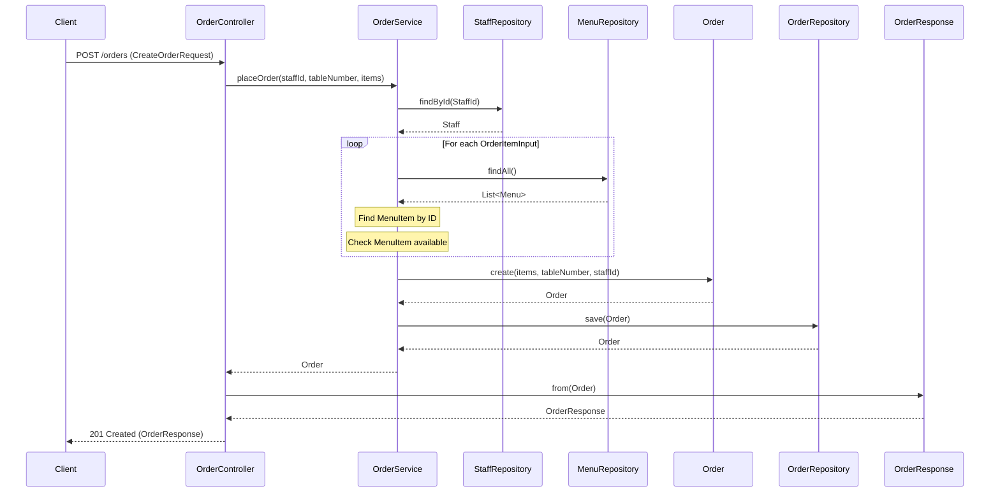
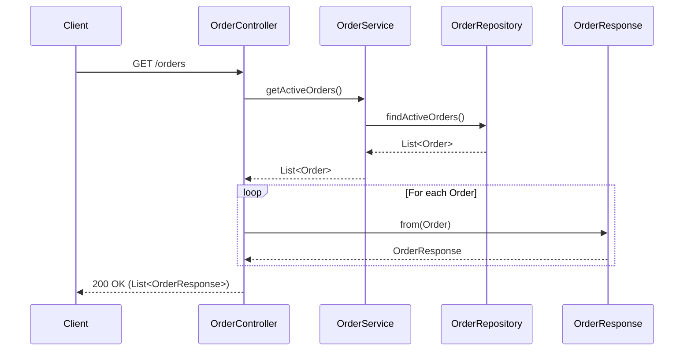
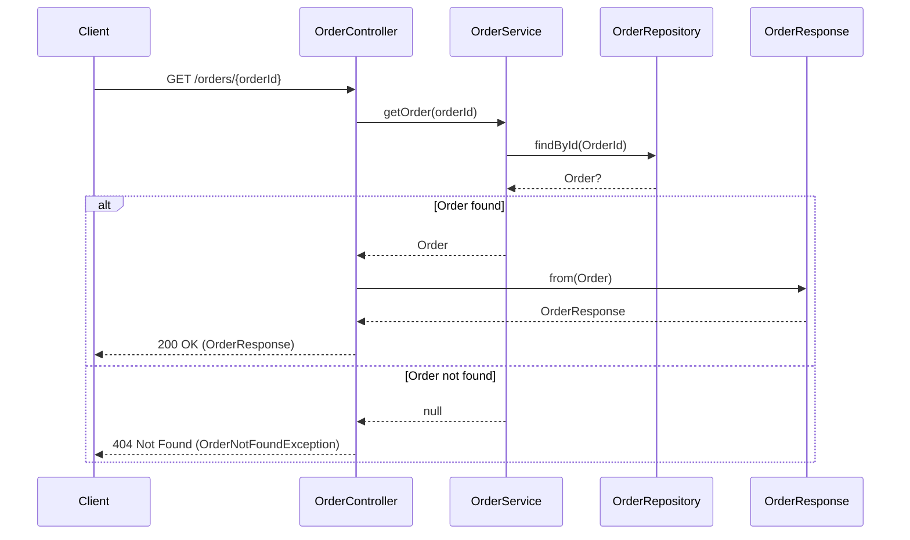
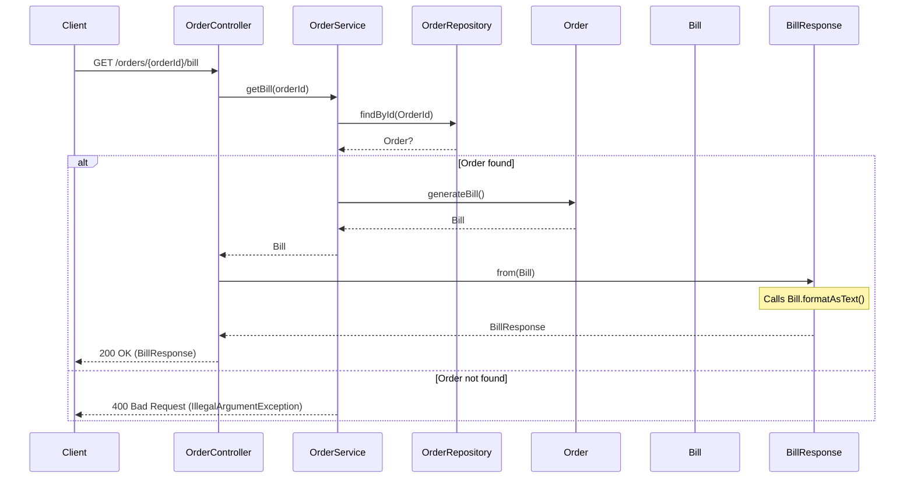
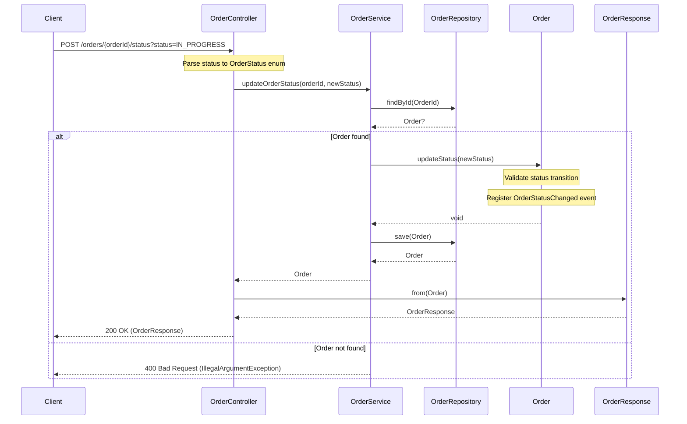
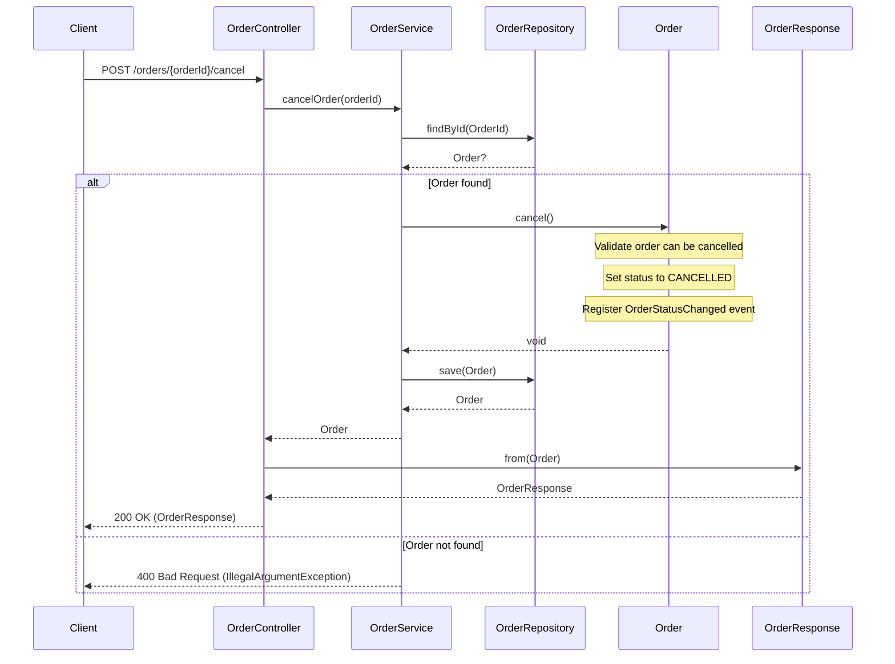
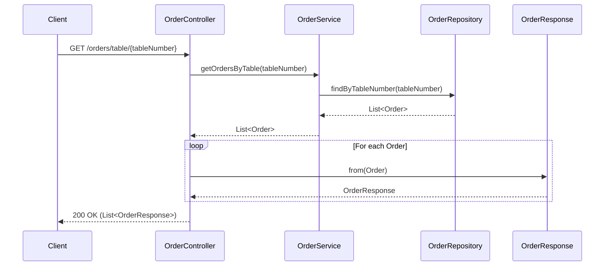

# Bar & Kitchen Stock Management System

A Domain-Driven Design (DDD) implementation for bar and kitchen stock management with role-based staff permissions.

## Tech Stack

- **Language**: Kotlin 2.1
- **Testing**: Kotest BehaviorSpec
- **ORM**: JetBrains Exposed
- **Frameworks**: SpringBoot, Spring JPA
- **Migrations**: Flyway
- **Database**: H2 (test/local), PostgreSQL (production)

## Getting Started

```bash
# Run tests
./gradlew.bat clean test

# Build
./gradlew.bat build
```

## Architecture

This project follows Domain-Driven Design principles with clear separation between:
- **Domain Layer**: Business logic, aggregates, value objects, domain events
- **Infrastructure Layer**: Persistence implementations using Exposed ORM

## Class Diagram

```mermaid
classDiagram
    direction TB

    %% ==================== SHARED BUILDING BLOCKS ====================
    namespace Shared {
        class Entity~ID~ {
            <<interface>>
            +id: ID
        }

        class AggregateRoot~ID~ {
            <<abstract>>
            -_domainEvents: MutableList~DomainEvent~
            +domainEvents: List~DomainEvent~
            #registerEvent(event: DomainEvent)
            +clearEvents()
        }

        class DomainEvent {
            <<interface>>
            +occurredAt: Instant
        }

        class DomainException {
            <<open>>
            +message: String
        }

        class InsufficientStockException
        class InvalidQuantityException
        class PermissionDeniedException
        class StockItemNotFoundException
        class StaffNotFoundException
        class LocationAccessDeniedException
    }

    AggregateRoot ..|> Entity
    InsufficientStockException --|> DomainException
    InvalidQuantityException --|> DomainException
    PermissionDeniedException --|> DomainException
    StockItemNotFoundException --|> DomainException
    StaffNotFoundException --|> DomainException
    LocationAccessDeniedException --|> DomainException

    %% ==================== STOCK DOMAIN ====================
    namespace StockDomain {
        class StockItem {
            <<AggregateRoot>>
            +id: StockItemId
            +name: String
            +category: StockCategory
            +quantity: Quantity
            +lowStockThreshold: LowStockThreshold?
            +allergens: Set~Allergen~
            +location: StockLocation
            +addStock(amount: Quantity)
            +removeStock(amount: Quantity)
            +adjustStock(newQuantity: Quantity, reason: String)
            +setLowStockThreshold(threshold: LowStockThreshold)
            +addAllergen(allergen: Allergen)
            +removeAllergen(allergen: Allergen)
            +updateAllergens(allergens: Set~Allergen~)
            +containsAllergen(allergen: Allergen): Boolean
            +isLowStock(): Boolean
            +create()$ StockItem
        }

        class Allergen {
            <<enumeration>>
            CELERY
            GLUTEN
            CRUSTACEANS
            EGGS
            FISH
            LUPIN
            MILK
            MOLLUSCS
            MUSTARD
            TREE_NUTS
            PEANUTS
            SESAME
            SOYBEANS
            SULPHITES
        }

        class StockItemId {
            <<value>>
            +value: String
            +generate()$ StockItemId
        }

        class Quantity {
            <<value>>
            +amount: BigDecimal
            +unit: Unit
            +plus(other: Quantity): Quantity
            +minus(other: Quantity): Quantity
            +isZero(): Boolean
            +isLessThan(other: Quantity): Boolean
            +isGreaterThan(other: Quantity): Boolean
            +zero(unit: Unit)$ Quantity
        }

        class Unit {
            <<enumeration>>
            BOTTLES
            LITERS
            KILOGRAMS
            GRAMS
            PIECES
            BOXES
        }

        class StockLocation {
            <<enumeration>>
            BAR
            KITCHEN
        }

        class LowStockThreshold {
            <<value>>
            +quantity: Quantity
            +isBreached(current: Quantity): Boolean
        }

        class StockCategory {
            <<sealed>>
            +displayName: String
            +location: StockLocation
        }

        class BarCategory {
            <<sealed>>
        }

        class KitchenCategory {
            <<sealed>>
        }

        class Spirits {
            <<object>>
        }
        class Wine {
            <<object>>
        }
        class Beer {
            <<object>>
        }
        class Mixers {
            <<object>>
        }
        class Garnishes {
            <<object>>
        }

        class Proteins {
            <<object>>
        }
        class Vegetables {
            <<object>>
        }
        class Dairy {
            <<object>>
        }
        class DryGoods {
            <<object>>
        }
        class Spices {
            <<object>>
        }
        class Frozen {
            <<object>>
        }
    }

    StockItem --|> AggregateRoot
    StockItem --> StockItemId
    StockItem --> Quantity
    StockItem --> StockCategory
    StockItem --> LowStockThreshold
    StockItem --> "*" Allergen : contains
    Quantity --> Unit
    StockCategory --> StockLocation
    LowStockThreshold --> Quantity

    BarCategory --|> StockCategory
    KitchenCategory --|> StockCategory

    Spirits --|> BarCategory
    Wine --|> BarCategory
    Beer --|> BarCategory
    Mixers --|> BarCategory
    Garnishes --|> BarCategory

    Proteins --|> KitchenCategory
    Vegetables --|> KitchenCategory
    Dairy --|> KitchenCategory
    DryGoods --|> KitchenCategory
    Spices --|> KitchenCategory
    Frozen --|> KitchenCategory

    %% ==================== STOCK EVENTS ====================
    namespace StockEvents {
        class StockEvent {
            <<sealed>>
            +stockItemId: StockItemId
            +occurredAt: Instant
        }

        class StockAdded {
            +quantityAdded: Quantity
            +newTotal: Quantity
        }

        class StockRemoved {
            +quantityRemoved: Quantity
            +newTotal: Quantity
        }

        class StockAdjusted {
            +previousQuantity: Quantity
            +newQuantity: Quantity
            +reason: String
        }

        class LowStockAlertRaised {
            +itemName: String
            +currentQuantity: Quantity
            +threshold: Quantity
        }

        class ThresholdUpdated {
            +previousThreshold: Quantity?
            +newThreshold: Quantity
        }

        class AllergensUpdated {
            +itemName: String
            +allergens: Set~Allergen~
        }
    }

    StockEvent ..|> DomainEvent
    StockAdded --|> StockEvent
    StockRemoved --|> StockEvent
    StockAdjusted --|> StockEvent
    LowStockAlertRaised --|> StockEvent
    ThresholdUpdated --|> StockEvent
    AllergensUpdated --|> StockEvent

    %% ==================== STAFF DOMAIN ====================
    namespace StaffDomain {
        class Staff {
            <<AggregateRoot>>
            +id: StaffId
            +name: StaffName
            +role: StaffRole
            +hasPermission(permission: Permission): Boolean
            +canAccessLocation(location: StockLocation): Boolean
            +changeRole(newRole: StaffRole)
            +create()$ Staff
        }

        class StaffId {
            <<value>>
            +value: String
            +generate()$ StaffId
        }

        class StaffName {
            <<value>>
            +firstName: String
            +lastName: String
            +fullName: String
        }

        class Permission {
            <<enumeration>>
            VIEW_STOCK
            ADD_STOCK
            REMOVE_STOCK
            ADJUST_STOCK
            SET_THRESHOLDS
            VIEW_AUDIT_LOG
            MANAGE_STAFF
        }

        class StaffRole {
            <<sealed>>
            +name: String
            +permissions: Set~Permission~
            +allowedLocations: Set~StockLocation~
            +hasPermission(permission: Permission): Boolean
            +canAccessLocation(location: StockLocation): Boolean
        }

        class Worker {
            +location: StockLocation
        }

        class Manager {
            +locations: Set~StockLocation~
        }
    }

    Staff --|> AggregateRoot
    Staff --> StaffId
    Staff --> StaffName
    Staff --> StaffRole
    StaffRole --> Permission
    StaffRole --> StockLocation
    Worker --|> StaffRole
    Manager --|> StaffRole

    %% ==================== REPOSITORIES ====================
    namespace Repositories {
        class StockRepository {
            <<interface>>
            +save(stockItem: StockItem): StockItem
            +findById(id: StockItemId): StockItem?
            +findByLocation(location: StockLocation): List~StockItem~
            +findByCategory(category: StockCategory): List~StockItem~
            +findByAllergen(allergen: Allergen): List~StockItem~
            +findContainingAnyAllergen(allergens: Set~Allergen~): List~StockItem~
            +findLowStockItems(): List~StockItem~
            +findAll(): List~StockItem~
            +delete(id: StockItemId)
        }

        class StaffRepository {
            <<interface>>
            +save(staff: Staff): Staff
            +findById(id: StaffId): Staff?
            +findByRole(roleType: Class): List~Staff~
            +findAll(): List~Staff~
            +delete(id: StaffId)
        }

        class StockEventRepository {
            <<interface>>
            +save(event: StockEvent)
            +findByStockItemId(id: StockItemId): List~StockEvent~
            +findAll(): List~StockEvent~
        }
    }

    StockRepository ..> StockItem
    StaffRepository ..> Staff
    StockEventRepository ..> StockEvent

    %% ==================== DOMAIN SERVICE ====================
    namespace DomainService {
        class StockOperationService {
            -stockRepository: StockRepository
            +viewStock(staff: Staff, location: StockLocation): List~StockItem~
            +viewAllStock(staff: Staff): List~StockItem~
            +addStock(staff: Staff, id: StockItemId, quantity: Quantity): StockItem
            +removeStock(staff: Staff, id: StockItemId, quantity: Quantity): StockItem
            +adjustStock(staff: Staff, id: StockItemId, quantity: Quantity, reason: String): StockItem
            +setLowStockThreshold(staff: Staff, id: StockItemId, threshold: LowStockThreshold): StockItem
            +viewLowStockItems(staff: Staff): List~StockItem~
        }
    }

    StockOperationService --> StockRepository
    StockOperationService ..> Staff
    StockOperationService ..> StockItem

    %% ==================== INFRASTRUCTURE ====================
    namespace Infrastructure {
        class ExposedStockRepository {
            +save(stockItem: StockItem): StockItem
            +findById(id: StockItemId): StockItem?
            +findByLocation(location: StockLocation): List~StockItem~
            +findByCategory(category: StockCategory): List~StockItem~
            +findLowStockItems(): List~StockItem~
            +findAll(): List~StockItem~
            +delete(id: StockItemId)
        }

        class ExposedStaffRepository {
            +save(staff: Staff): Staff
            +findById(id: StaffId): Staff?
            +findByRole(roleType: Class): List~Staff~
            +findAll(): List~Staff~
            +delete(id: StaffId)
        }

        class ExposedStockEventRepository {
            +save(event: StockEvent)
            +findByStockItemId(id: StockItemId): List~StockEvent~
            +findAll(): List~StockEvent~
        }

        class DatabaseConfig {
            +h2InMemory(dbName: String)$ DatabaseSettings
            +postgresql(...)$ DatabaseSettings
        }

        class DatabaseInitializer {
            +initialize(): Database
            +close()
        }
    }

    ExposedStockRepository ..|> StockRepository
    ExposedStaffRepository ..|> StaffRepository
    ExposedStockEventRepository ..|> StockEventRepository
    ExposedStockRepository --> DatabaseInitializer
    ExposedStaffRepository --> DatabaseInitializer
    ExposedStockEventRepository --> DatabaseInitializer
    DatabaseInitializer --> DatabaseConfig
```



## Permissions Matrix

| Permission       | Worker | Manager |
|------------------|:------:|:-------:|
| VIEW_STOCK       |   ✓    |    ✓    |
| ADD_STOCK        |   ✓    |    ✓    |
| REMOVE_STOCK     |   ✓    |    ✓    |
| ADJUST_STOCK     |   ✗    |    ✓    |
| SET_THRESHOLDS   |   ✗    |    ✓    |
| VIEW_AUDIT_LOG   |   ✗    |    ✓    |
| MANAGE_STAFF     |   ✗    |    ✓    |

## Allergens

The system supports the 14 major food allergens as defined by food safety regulations. Each stock item can have zero or more allergens:

| Allergen | Description |
|----------|-------------|
| CELERY | Celery and celeriac |
| GLUTEN | Cereals containing gluten (wheat, rye, barley, oats) |
| CRUSTACEANS | Crabs, lobster, prawns, shrimp |
| EGGS | Eggs and egg products |
| FISH | Fish and fish products |
| LUPIN | Lupin seeds and flour |
| MILK | Milk and dairy products |
| MOLLUSCS | Mussels, oysters, squid, snails |
| MUSTARD | Mustard seeds and powder |
| TREE_NUTS | Almonds, hazelnuts, walnuts, cashews, etc. |
| PEANUTS | Peanuts and peanut products |
| SESAME | Sesame seeds and oil |
| SOYBEANS | Soybeans and soy products |
| SULPHITES | Sulphur dioxide and sulphites (>10mg/kg) |

## Stock Categories

### Bar
- Spirits
- Wine
- Beer
- Mixers
- Garnishes

### Kitchen
- Proteins
- Vegetables
- Dairy
- Dry Goods
- Spices
- Frozen

## Project Structure

```
src/
├── main/kotlin/com/gaywood/stock/
│   ├── domain/
│   │   ├── shared/           # Entity, AggregateRoot, DomainEvent, Exceptions
│   │   ├── stock/
│   │   │   ├── model/        # StockItem aggregate, value objects
│   │   │   ├── event/        # Domain events
│   │   │   └── repository/   # Repository interface
│   │   ├── staff/
│   │   │   ├── model/        # Staff aggregate, StaffRole, Permission
│   │   │   └── repository/   # Repository interface
│   │   └── operation/
│   │       └── service/      # StockOperationService
│   └── infrastructure/
│       └── persistence/      # Exposed repositories, DB config
└── test/kotlin/com/gaywood/stock/
    ├── domain/               # Unit tests
    ├── infrastructure/       # Integration tests
    └── fixtures/             # Test fixtures
```

## Order API Sequence Diagrams

The following sequence diagrams show the flow of each OrderController endpoint through the application layers.

### POST /orders - Create Order



### GET /orders - Get Active Orders



### GET /orders/{orderId} - Get Order by ID



### GET /orders/{orderId}/bill - Get Bill for Order



### POST /orders/{orderId}/status - Update Order Status



### POST /orders/{orderId}/cancel - Cancel Order



### GET /orders/table/{tableNumber} - Get Orders by Table



## Database Migrations

Migrations are located in `src/main/resources/db/migration/`:

- `V1__create_stock_items_table.sql` - Stock items table
- `V2__create_staff_table.sql` - Staff table
- `V3__create_stock_events_table.sql` - Stock events audit table
- `V4__create_stock_item_allergens_table.sql` - Stock item allergens (many-to-many)

All migrations are idempotent and support both H2 and PostgreSQL.
