# Bar & Kitchen Stock Management System

A Domain-Driven Design (DDD) implementation for bar and kitchen stock management with role-based staff permissions.

## Tech Stack

- **Language**: Kotlin 2.1
- **Framework**: Spring Boot 3.4
- **APIs**: REST (Spring Web) + gRPC (grpc-spring-boot-starter)
- **ORM**: Spring Data JPA / Hibernate
- **Async**: Kotlin Coroutines
- **Validation**: Jakarta Validation (Bean Validation 3.0)
- **API Documentation**: SpringDoc OpenAPI / Swagger UI
- **Feature Flags**: Togglz
- **Testing**: Kotest (BehaviorSpec, FunSpec)
- **Migrations**: Flyway
- **Database**: H2 (test), PostgreSQL (production)

## Project Structure (Multi-Module)

```
stock/
├── stock-core/                    # Core business logic
│   └── src/main/kotlin/
│       ├── api/                   # REST controllers, DTOs
│       ├── application/           # Application services
│       ├── domain/                # Domain model (aggregates, events)
│       └── infrastructure/        # JPA persistence, config
│
├── stock-grpc/                    # gRPC gateway
│   ├── src/main/proto/            # Proto definitions
│   └── src/main/kotlin/           # gRPC service implementations
│
├── stock-boot/                    # Spring Boot assembly
│   ├── src/main/kotlin/           # Application.kt
│   ├── src/main/resources/        # Config, migrations
│   └── src/test/kotlin/           # Integration tests
│
├── build.gradle.kts               # Root build config
├── settings.gradle.kts            # Module declarations
└── gradle/libs.versions.toml      # Version catalog
```

## Getting Started

```bash
# Run tests
./gradlew.bat clean test

# Build all modules
./gradlew.bat build

# Build specific module
./gradlew.bat :stock-core:build
./gradlew.bat :stock-grpc:build
./gradlew.bat :stock-boot:build
```

## Running Locally

Run the application locally using the `local` profile, which uses an H2 in-memory database (no PostgreSQL required):

```bash
./gradlew.bat :stock-boot:bootRun --args='--spring.profiles.active=local'
```

Once started, the following endpoints are available:

| URL | Description |
|-----|-------------|
| http://localhost:8080/health | Health check endpoint (REST) |
| http://localhost:8080/swagger-ui.html | Interactive API documentation |
| http://localhost:8080/api-docs | OpenAPI JSON specification |
| http://localhost:8080/h2-console | H2 database console |
| http://localhost:8080/togglz-console | Feature flags management |
| localhost:9090 | gRPC server |

### Testing gRPC with grpcurl

```bash
# List available services
grpcurl -plaintext localhost:9090 list

# List methods in OrderService
grpcurl -plaintext localhost:9090 list stock.v1.OrderService

# Get active orders
grpcurl -plaintext localhost:9090 stock.v1.OrderService/ListActiveOrders

# Health check
grpcurl -plaintext localhost:9090 stock.v1.HealthService/Check
```

The local profile:
- Uses H2 in-memory database in PostgreSQL compatibility mode
- Disables Flyway migrations (uses Hibernate auto DDL)
- Enables H2 console for database inspection
- Enables DEBUG logging for SQL and application code

## Architecture

This project follows Domain-Driven Design principles with clear separation between:
- **API Layer**: REST controllers + gRPC services, DTOs, exception handlers
- **Application Layer**: Orchestration services (OrderService)
- **Domain Layer**: Business logic, aggregates, value objects, domain events, domain services
- **Infrastructure Layer**: JPA persistence, Togglz configuration

### API Gateway Architecture

```
┌─────────────────────────────────────────────────────────┐
│                      Clients                             │
└─────────────────┬───────────────────────┬───────────────┘
                  │                       │
          ┌───────▼───────┐       ┌───────▼───────┐
          │  REST :8080   │       │  gRPC :9090   │
          │ (stock-core)  │       │ (stock-grpc)  │
          └───────┬───────┘       └───────┬───────┘
                  │                       │
                  └───────────┬───────────┘
                              │
                    ┌─────────▼─────────┐
                    │  Application Layer │
                    │   (OrderService)   │
                    └─────────┬─────────┘
                              │
                    ┌─────────▼─────────┐
                    │    Domain Layer    │
                    │ (Aggregates, etc.) │
                    └─────────┬─────────┘
                              │
                    ┌─────────▼─────────┐
                    │ Infrastructure     │
                    │ (JPA, PostgreSQL)  │
                    └───────────────────┘
```

## gRPC API

The gRPC gateway provides full API parity with REST endpoints.

### Services

| Service | Methods |
|---------|---------|
| `OrderService` | CreateOrder, GetOrder, ListActiveOrders, GetBill, UpdateOrderStatus, CancelOrder, ListOrdersByTable |
| `HealthService` | Check, Ready, Live, Features |
| `StockService` | AddStock, RemoveStock, GetStockItem, ListStockItems, GetLowStockItems |
| `MenuService` | GetMenu, ListMenus, GetMenuItem, ListMenuItems |

### Proto Files

Located in `stock-grpc/src/main/proto/stock/v1/`:

| File | Description |
|------|-------------|
| `common.proto` | Shared types (Price, PageRequest, OrderStatus) |
| `order_service.proto` | Order management operations |
| `health_service.proto` | Health checks and feature flags |
| `stock_service.proto` | Stock management operations |
| `menu_service.proto` | Menu operations |

### REST to gRPC Mapping

| REST Endpoint | gRPC Method |
|---------------|-------------|
| `POST /orders` | `OrderService.CreateOrder` |
| `GET /orders` | `OrderService.ListActiveOrders` |
| `GET /orders/{id}` | `OrderService.GetOrder` |
| `GET /orders/{id}/bill` | `OrderService.GetBill` |
| `POST /orders/{id}/status` | `OrderService.UpdateOrderStatus` |
| `POST /orders/{id}/cancel` | `OrderService.CancelOrder` |
| `GET /orders/table/{n}` | `OrderService.ListOrdersByTable` |
| `GET /health` | `HealthService.Check` |
| `GET /health/ready` | `HealthService.Ready` |
| `GET /health/live` | `HealthService.Live` |
| `GET /health/features` | `HealthService.Features` |

### Exception Mapping

| Domain Exception | gRPC Status |
|------------------|-------------|
| `OrderNotFoundException` | `NOT_FOUND` |
| `StaffNotFoundException` | `NOT_FOUND` |
| `MenuItemNotFoundException` | `NOT_FOUND` |
| `PermissionDeniedException` | `PERMISSION_DENIED` |
| `InsufficientStockException` | `FAILED_PRECONDITION` |
| `InvalidQuantityException` | `INVALID_ARGUMENT` |

## Class Diagram

```mermaid
classDiagram
    direction TB

    %% ==================== SHARED BUILDING BLOCKS ====================
    namespace Shared {
        class Entity~ID~ {
            <<interface>>
            +id: ID
        }

        class AggregateRoot~ID~ {
            <<abstract>>
            -_domainEvents: MutableList~DomainEvent~
            +domainEvents: List~DomainEvent~
            #registerEvent(event: DomainEvent)
            +clearEvents()
        }

        class DomainEvent {
            <<interface>>
            +occurredAt: Instant
        }

        class DomainException {
            <<open>>
            +message: String
        }

        class InsufficientStockException
        class InvalidQuantityException
        class PermissionDeniedException
        class StockItemNotFoundException
        class StaffNotFoundException
        class LocationAccessDeniedException
    }

    AggregateRoot ..|> Entity
    InsufficientStockException --|> DomainException
    InvalidQuantityException --|> DomainException
    PermissionDeniedException --|> DomainException
    StockItemNotFoundException --|> DomainException
    StaffNotFoundException --|> DomainException
    LocationAccessDeniedException --|> DomainException

    %% ==================== STOCK DOMAIN ====================
    namespace StockDomain {
        class StockItem {
            <<AggregateRoot>>
            +id: StockItemId
            +name: String
            +category: StockCategory
            +quantity: Quantity
            +lowStockThreshold: LowStockThreshold?
            +allergens: Set~Allergen~
            +location: StockLocation
            +addStock(amount: Quantity)
            +removeStock(amount: Quantity)
            +adjustStock(newQuantity: Quantity, reason: String)
            +setLowStockThreshold(threshold: LowStockThreshold)
            +addAllergen(allergen: Allergen)
            +removeAllergen(allergen: Allergen)
            +updateAllergens(allergens: Set~Allergen~)
            +containsAllergen(allergen: Allergen): Boolean
            +isLowStock(): Boolean
            +create()$ StockItem
        }

        class Allergen {
            <<enumeration>>
            CELERY
            GLUTEN
            CRUSTACEANS
            EGGS
            FISH
            LUPIN
            MILK
            MOLLUSCS
            MUSTARD
            TREE_NUTS
            PEANUTS
            SESAME
            SOYBEANS
            SULPHITES
        }

        class StockItemId {
            <<value>>
            +value: String
            +generate()$ StockItemId
        }

        class Quantity {
            <<value>>
            +amount: BigDecimal
            +unit: Unit
            +plus(other: Quantity): Quantity
            +minus(other: Quantity): Quantity
            +isZero(): Boolean
            +isLessThan(other: Quantity): Boolean
            +isGreaterThan(other: Quantity): Boolean
            +zero(unit: Unit)$ Quantity
        }

        class Unit {
            <<enumeration>>
            BOTTLES
            LITERS
            KILOGRAMS
            GRAMS
            PIECES
            BOXES
        }

        class StockLocation {
            <<enumeration>>
            BAR
            KITCHEN
        }

        class LowStockThreshold {
            <<value>>
            +quantity: Quantity
            +isBreached(current: Quantity): Boolean
        }

        class StockCategory {
            <<sealed>>
            +displayName: String
            +location: StockLocation
        }

        class BarCategory {
            <<sealed>>
        }

        class KitchenCategory {
            <<sealed>>
        }

        class Spirits {
            <<object>>
        }
        class Wine {
            <<object>>
        }
        class Beer {
            <<object>>
        }
        class Mixers {
            <<object>>
        }
        class Garnishes {
            <<object>>
        }

        class Proteins {
            <<object>>
        }
        class Vegetables {
            <<object>>
        }
        class Dairy {
            <<object>>
        }
        class DryGoods {
            <<object>>
        }
        class Spices {
            <<object>>
        }
        class Frozen {
            <<object>>
        }
    }

    StockItem --|> AggregateRoot
    StockItem --> StockItemId
    StockItem --> Quantity
    StockItem --> StockCategory
    StockItem --> LowStockThreshold
    StockItem --> "*" Allergen : contains
    Quantity --> Unit
    StockCategory --> StockLocation
    LowStockThreshold --> Quantity

    BarCategory --|> StockCategory
    KitchenCategory --|> StockCategory

    Spirits --|> BarCategory
    Wine --|> BarCategory
    Beer --|> BarCategory
    Mixers --|> BarCategory
    Garnishes --|> BarCategory

    Proteins --|> KitchenCategory
    Vegetables --|> KitchenCategory
    Dairy --|> KitchenCategory
    DryGoods --|> KitchenCategory
    Spices --|> KitchenCategory
    Frozen --|> KitchenCategory

    %% ==================== STOCK EVENTS ====================
    namespace StockEvents {
        class StockEvent {
            <<sealed>>
            +stockItemId: StockItemId
            +occurredAt: Instant
        }

        class StockAdded {
            +quantityAdded: Quantity
            +newTotal: Quantity
        }

        class StockRemoved {
            +quantityRemoved: Quantity
            +newTotal: Quantity
        }

        class StockAdjusted {
            +previousQuantity: Quantity
            +newQuantity: Quantity
            +reason: String
        }

        class LowStockAlertRaised {
            +itemName: String
            +currentQuantity: Quantity
            +threshold: Quantity
        }

        class ThresholdUpdated {
            +previousThreshold: Quantity?
            +newThreshold: Quantity
        }

        class AllergensUpdated {
            +itemName: String
            +allergens: Set~Allergen~
        }
    }

    StockEvent ..|> DomainEvent
    StockAdded --|> StockEvent
    StockRemoved --|> StockEvent
    StockAdjusted --|> StockEvent
    LowStockAlertRaised --|> StockEvent
    ThresholdUpdated --|> StockEvent
    AllergensUpdated --|> StockEvent

    %% ==================== STAFF DOMAIN ====================
    namespace StaffDomain {
        class Staff {
            <<AggregateRoot>>
            +id: StaffId
            +name: StaffName
            +role: StaffRole
            +hasPermission(permission: Permission): Boolean
            +canAccessLocation(location: StockLocation): Boolean
            +promoteToManager(locations: Set~StockLocation~)
            +demoteToWorker(location: StockLocation)
            +changeRole(newRole: StaffRole)
            +create()$ Staff
        }

        class StaffId {
            <<value>>
            +value: String
            +generate()$ StaffId
        }

        class StaffName {
            <<value>>
            +firstName: String
            +lastName: String
            +fullName: String
        }

        class Permission {
            <<enumeration>>
            VIEW_STOCK
            ADD_STOCK
            REMOVE_STOCK
            ADJUST_STOCK
            SET_THRESHOLDS
            VIEW_AUDIT_LOG
            MANAGE_STAFF
        }

        class StaffRole {
            <<sealed>>
            +name: String
            +permissions: Set~Permission~
            +allowedLocations: Set~StockLocation~
            +hasPermission(permission: Permission): Boolean
            +canAccessLocation(location: StockLocation): Boolean
        }

        class Worker {
            +location: StockLocation
        }

        class Manager {
            +locations: Set~StockLocation~
        }
    }

    Staff --|> AggregateRoot
    Staff --> StaffId
    Staff --> StaffName
    Staff --> StaffRole
    StaffRole --> Permission
    StaffRole --> StockLocation
    Worker --|> StaffRole
    Manager --|> StaffRole

    %% ==================== STAFF EVENTS ====================
    namespace StaffEvents {
        class StaffEvent {
            <<sealed>>
            +staffId: StaffId
            +occurredAt: Instant
        }

        class StaffRoleChanged {
            +previousRole: StaffRole
            +newRole: StaffRole
        }
    }

    StaffEvent ..|> DomainEvent
    StaffRoleChanged --|> StaffEvent

    %% ==================== REPOSITORIES ====================
    namespace Repositories {
        class StockRepository {
            <<interface>>
            +save(stockItem: StockItem): StockItem
            +findById(id: StockItemId): StockItem?
            +findByLocation(location: StockLocation): List~StockItem~
            +findByCategory(category: StockCategory): List~StockItem~
            +findAll(): List~StockItem~
            +delete(id: StockItemId)
        }

        class StaffRepository {
            <<interface>>
            +save(staff: Staff): Staff
            +findById(id: StaffId): Staff?
            +findByRole(roleType: Class): List~Staff~
            +findAll(): List~Staff~
            +delete(id: StaffId)
        }

        class StockEventRepository {
            <<interface>>
            +save(event: StockEvent)
            +findByStockItemId(id: StockItemId): List~StockEvent~
            +findAll(): List~StockEvent~
        }
    }

    StockRepository ..> StockItem
    StaffRepository ..> Staff
    StockEventRepository ..> StockEvent

    %% ==================== DOMAIN SERVICES ====================
    namespace DomainService {
        class StockQueryService {
            -stockRepository: StockRepository
            +findLowStockItems(): List~StockItem~
            +findItemsWithAllergen(allergen: Allergen): List~StockItem~
            +findItemsContainingAnyAllergen(allergens: Set~Allergen~): List~StockItem~
        }

        class StockOperationService {
            -stockRepository: StockRepository
            -stockQueryService: StockQueryService
            +viewStock(staff: Staff, location: StockLocation): List~StockItem~
            +viewAllStock(staff: Staff): List~StockItem~
            +addStock(staff: Staff, id: StockItemId, quantity: Quantity): StockItem
            +removeStock(staff: Staff, id: StockItemId, quantity: Quantity): StockItem
            +adjustStock(staff: Staff, id: StockItemId, quantity: Quantity, reason: String): StockItem
            +setLowStockThreshold(staff: Staff, id: StockItemId, threshold: LowStockThreshold): StockItem
            +viewLowStockItems(staff: Staff): List~StockItem~
        }
    }

    StockQueryService --> StockRepository
    StockOperationService --> StockRepository
    StockOperationService --> StockQueryService
    StockOperationService ..> Staff
    StockOperationService ..> StockItem

    %% ==================== INFRASTRUCTURE ====================
    namespace Infrastructure {
        class JpaStockRepositoryAdapter {
            +save(stockItem: StockItem): StockItem
            +findById(id: StockItemId): StockItem?
            +findByLocation(location: StockLocation): List~StockItem~
            +findByCategory(category: StockCategory): List~StockItem~
            +findAll(): List~StockItem~
            +delete(id: StockItemId)
        }

        class JpaStaffRepositoryAdapter {
            +save(staff: Staff): Staff
            +findById(id: StaffId): Staff?
            +findByRole(roleType: Class): List~Staff~
            +findAll(): List~Staff~
            +delete(id: StaffId)
        }

        class JpaOrderRepositoryAdapter {
            +save(order: Order): Order
            +findById(id: OrderId): Order?
            +findActiveOrders(): List~Order~
            +findByTableNumber(tableNumber: Int): List~Order~
        }

        class JpaMenuRepositoryAdapter {
            +save(menu: Menu): Menu
            +findById(id: MenuId): Menu?
            +findAll(): List~Menu~
        }
    }

    JpaStockRepositoryAdapter ..|> StockRepository
    JpaStaffRepositoryAdapter ..|> StaffRepository
    JpaOrderRepositoryAdapter ..|> OrderRepository
    JpaMenuRepositoryAdapter ..|> MenuRepository
```



## Permissions Matrix

| Permission       | Worker | Manager |
|------------------|:------:|:-------:|
| VIEW_STOCK       |   ✓    |    ✓    |
| ADD_STOCK        |   ✓    |    ✓    |
| REMOVE_STOCK     |   ✓    |    ✓    |
| ADJUST_STOCK     |   ✗    |    ✓    |
| SET_THRESHOLDS   |   ✗    |    ✓    |
| VIEW_AUDIT_LOG   |   ✗    |    ✓    |
| MANAGE_STAFF     |   ✗    |    ✓    |

## Allergens

The system supports the 14 major food allergens as defined by food safety regulations. Each stock item can have zero or more allergens:

| Allergen | Description |
|----------|-------------|
| CELERY | Celery and celeriac |
| GLUTEN | Cereals containing gluten (wheat, rye, barley, oats) |
| CRUSTACEANS | Crabs, lobster, prawns, shrimp |
| EGGS | Eggs and egg products |
| FISH | Fish and fish products |
| LUPIN | Lupin seeds and flour |
| MILK | Milk and dairy products |
| MOLLUSCS | Mussels, oysters, squid, snails |
| MUSTARD | Mustard seeds and powder |
| TREE_NUTS | Almonds, hazelnuts, walnuts, cashews, etc. |
| PEANUTS | Peanuts and peanut products |
| SESAME | Sesame seeds and oil |
| SOYBEANS | Soybeans and soy products |
| SULPHITES | Sulphur dioxide and sulphites (>10mg/kg) |

## Stock Categories

### Bar
- Spirits
- Wine
- Beer
- Mixers
- Garnishes

### Kitchen
- Proteins
- Vegetables
- Dairy
- Dry Goods
- Spices
- Frozen

## Health Endpoints

The application provides health endpoints for monitoring and deployment orchestration via both REST and gRPC:

### REST Endpoints

| Endpoint | Purpose | Response |
|----------|---------|----------|
| `GET /health` | Full health check | Status + all components |
| `GET /health/ready` | Readiness probe (K8s) | Database + feature flags status |
| `GET /health/live` | Liveness probe (K8s) | Simple UP status |
| `GET /health/features` | Feature flags status | All feature flag states |

### gRPC Methods

| Method | Purpose |
|--------|---------|
| `HealthService.Check` | Full health check |
| `HealthService.Ready` | Readiness probe |
| `HealthService.Live` | Liveness probe |
| `HealthService.Features` | Feature flags status |

### Example Responses

**GET /health/ready**
```json
{
  "status": "UP",
  "components": {
    "database": { "status": "UP" },
    "featureFlags": { "status": "UP" }
  }
}
```

**GET /health/features**
```json
{
  "features": {
    "ORDER_NOTIFICATIONS": false,
    "LOW_STOCK_ALERTS": true,
    "KITCHEN_DISPLAY": false,
    "TABLE_RESERVATIONS": false,
    "LOYALTY_POINTS": false
  }
}
```

## Feature Flags (Togglz)

The application uses Togglz for feature flag management.

### Available Features

| Feature | Default | Description |
|---------|---------|-------------|
| `ORDER_NOTIFICATIONS` | Off | Send notifications when order status changes |
| `LOW_STOCK_ALERTS` | **On** | Automatically alert when stock falls below threshold |
| `KITCHEN_DISPLAY` | Off | Enable kitchen display system integration |
| `TABLE_RESERVATIONS` | Off | Enable table reservation functionality |
| `LOYALTY_POINTS` | Off | Enable customer loyalty points system |

### Togglz Console

Access the web console at `/togglz-console` to toggle features at runtime.

### Usage in Code

```kotlin
// Using injected FeatureManager (recommended)
if (featureManager.isActive(Features.LOW_STOCK_ALERTS)) {
    sendLowStockAlert(item)
}

// Using static method
if (Features.KITCHEN_DISPLAY.isActive()) {
    updateKitchenDisplay(order)
}
```

## API Documentation (OpenAPI/Swagger)

The REST API is documented using SpringDoc OpenAPI with Swagger UI.

### Endpoints

| URL | Description |
|-----|-------------|
| `/swagger-ui.html` | Interactive Swagger UI |
| `/api-docs` | OpenAPI JSON specification |

### Features

- Full API documentation with request/response examples
- Schema validation constraints visible in documentation
- Try-it-out functionality for testing endpoints

## Validation

The application uses Jakarta Validation annotations for input validation at both API and domain layers.

### API Layer Validation

| Field | Constraints |
|-------|-------------|
| `staffId` | `@NotBlank`, `@Pattern` (UUID format) |
| `menuItemId` | `@NotBlank`, `@Pattern` (UUID format) |
| `tableNumber` | `@Min(1)`, `@Max(999)` |
| `quantity` | `@Positive`, `@Max(99)` |
| `notes` | `@Size(max=500)` |
| `items` | `@NotEmpty`, `@Size(max=50)` |

### Domain Layer Validation

| Type | Constraints |
|------|-------------|
| `Quantity.amount` | `@DecimalMin("0.0")`, `@Digits(integer=10, fraction=3)` |
| `Price.amount` | `@DecimalMin("0.0")`, `@Digits(integer=8, fraction=2)` |
| `StaffName.firstName/lastName` | `@NotBlank`, `@Size(min=1, max=100)` |
| All ID value classes | Non-blank validation via init blocks |

## Database Migrations

Migrations are located in `stock-boot/src/main/resources/db/migration/`:

| Migration | Description |
|-----------|-------------|
| `V1__create_stock_items_table.sql` | Stock items table |
| `V2__create_staff_table.sql` | Staff table |
| `V3__create_stock_events_table.sql` | Stock events audit table |
| `V4__create_stock_item_allergens_table.sql` | Stock item allergens (many-to-many) |
| `V5__create_menu_tables.sql` | Menus and menu items tables |
| `V6__create_order_tables.sql` | Orders and order items tables |
| `V7__add_menu_item_cached_allergens.sql` | Menu item cached allergens for efficient querying |

All migrations are idempotent and support both H2 and PostgreSQL.
