# Stock Management System Overview

This document provides visual diagrams explaining the architecture and flow of the stock management system.

## Multi-Module Structure

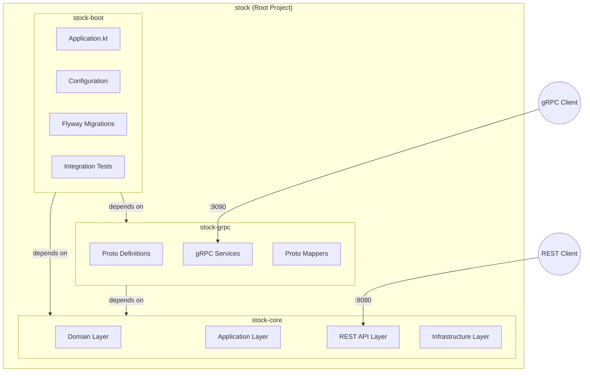

## Architecture Overview

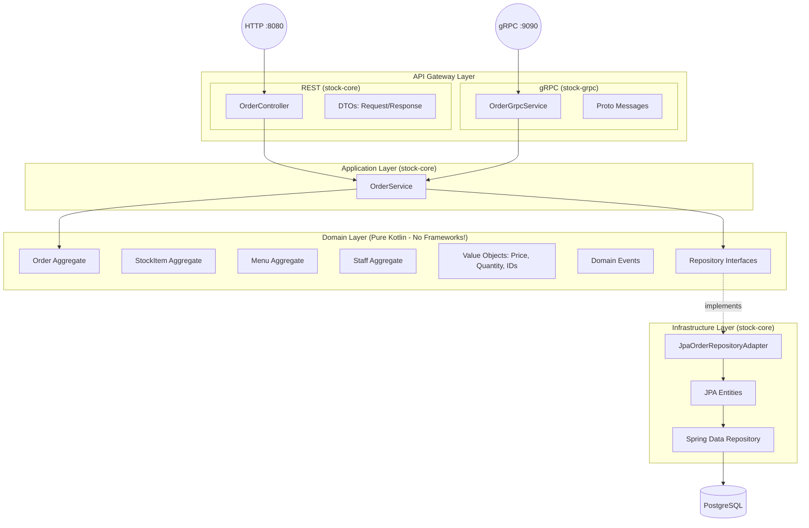

## gRPC Service Mapping

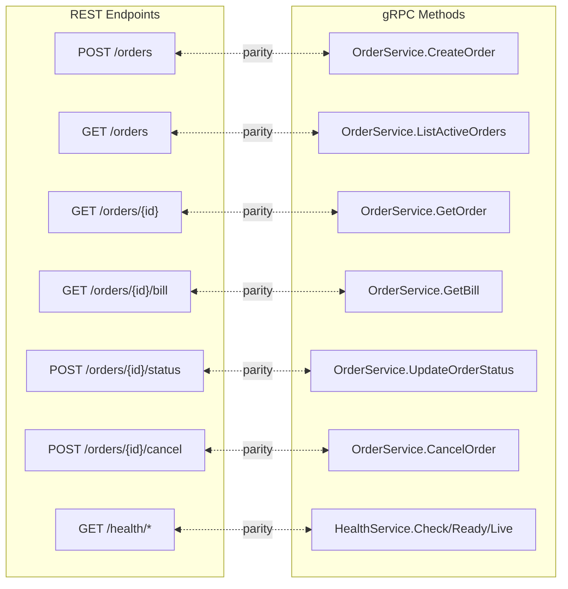

## Order Lifecycle

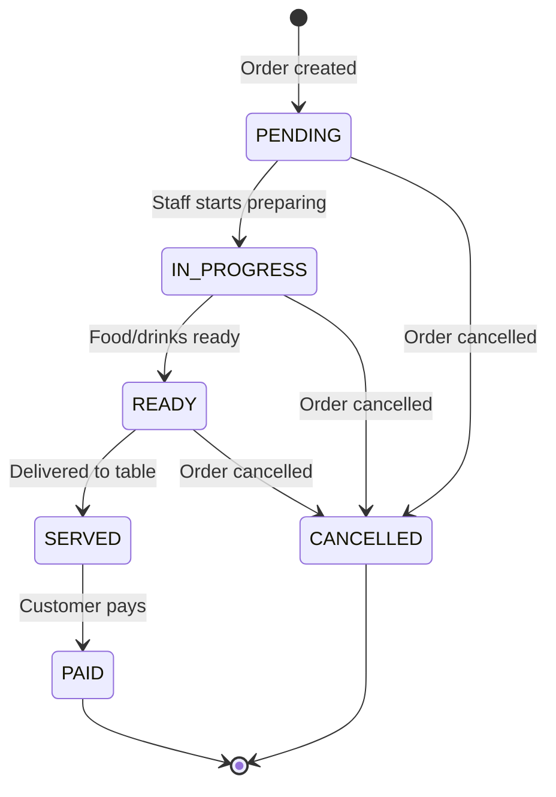

## Request Flow: Placing an Order (REST)

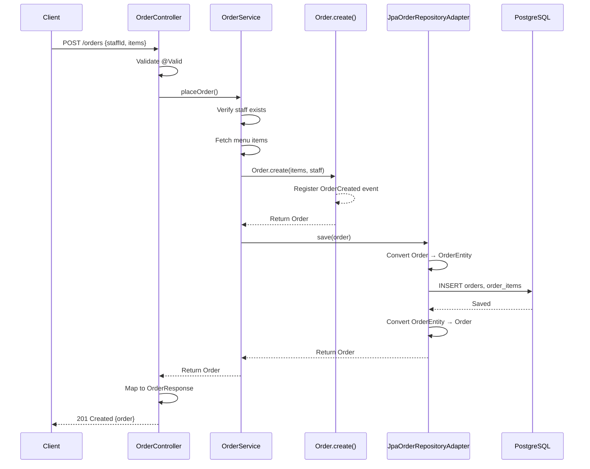

## Request Flow: Placing an Order (gRPC)

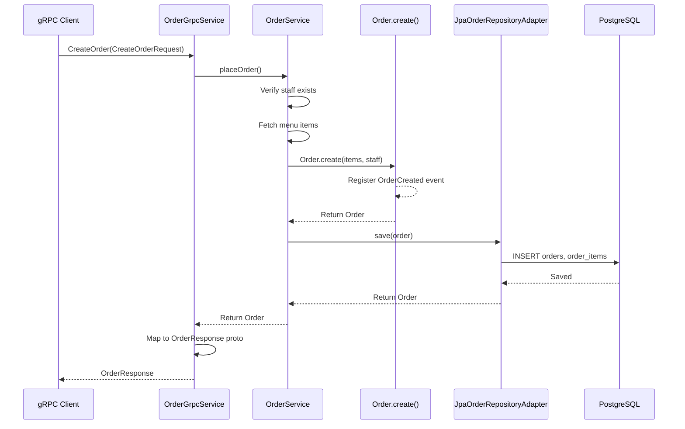

## Domain Layer Structure

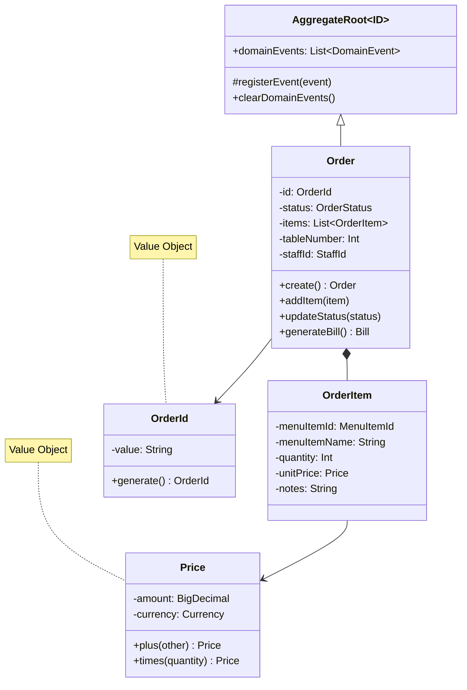

## Staff Permissions

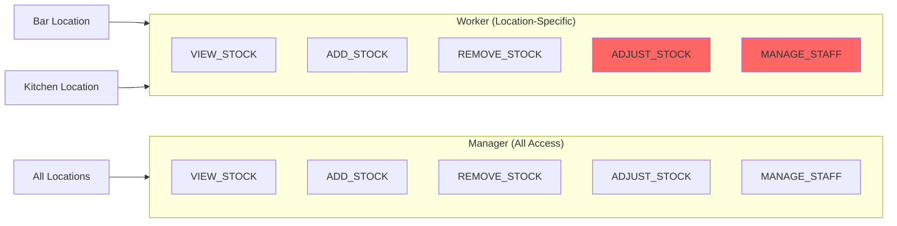

## Proto Message Structure

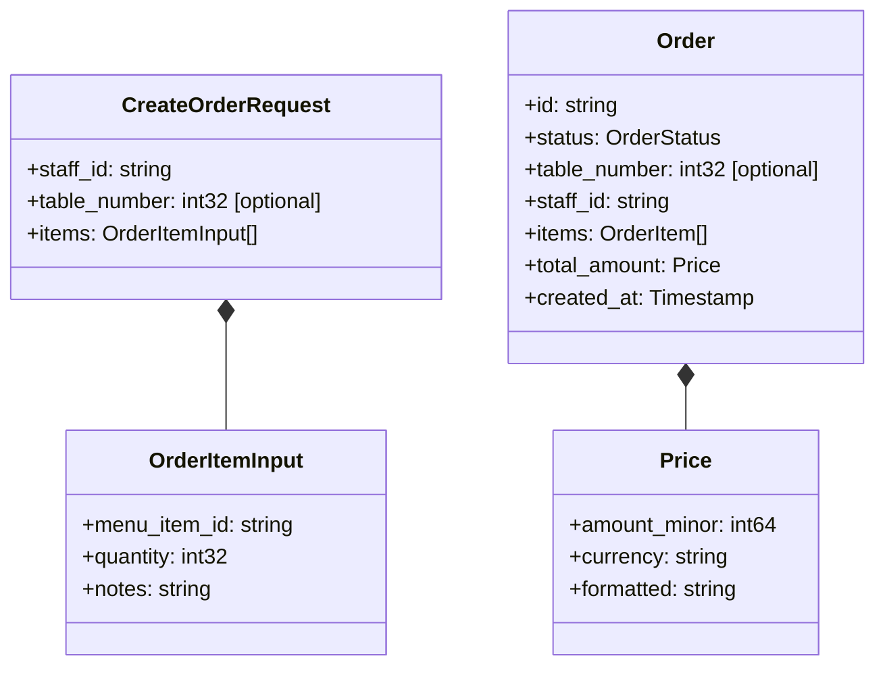

## Snapshot Pattern (OrderItem)

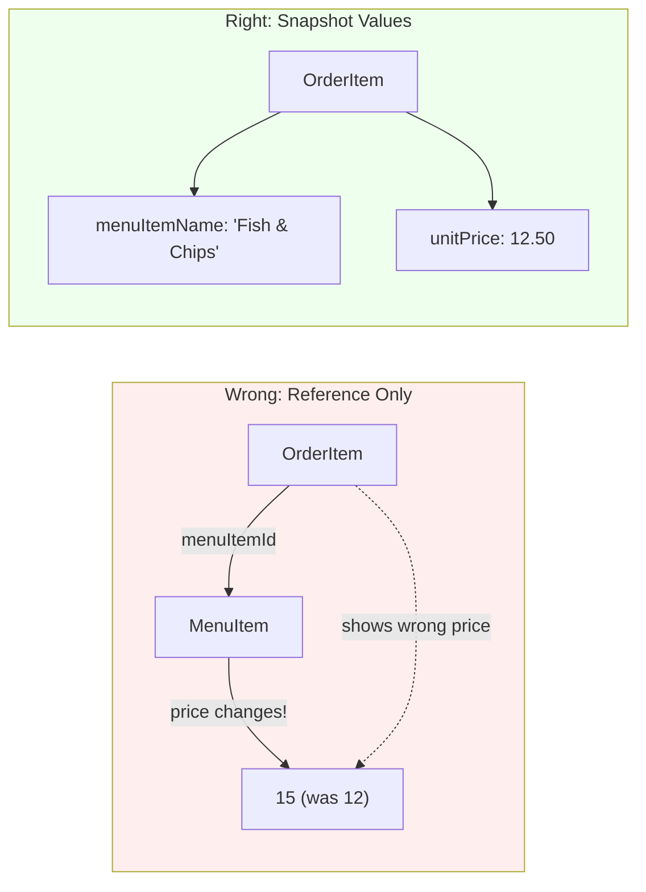

The `OrderItem` stores `menuItemName` and `unitPrice` directly - these are snapshots of what the customer actually ordered. If the menu price changes later, historical orders remain accurate.

## Exception Handling

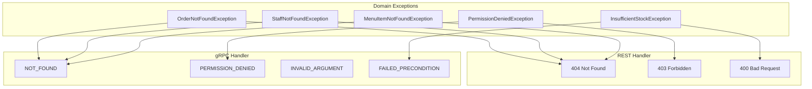
